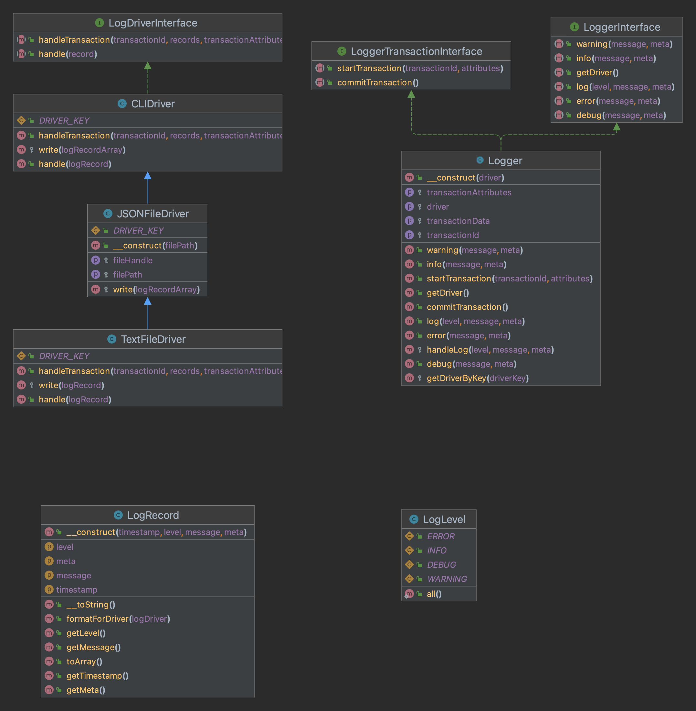

# Telemetry Logger
 
This package offers a variety of features for meaningful logging. The goal is to remove
the need to run, operate and maintain multiple agents/collectors in order to support telemetry
data, like logs or transactions. The code using this package never has to be adjusted
when changing the logging technology.

## Installation & Configuration
This package requires >= PHP8.0. You can install the package via composer as shown below.

```bash
composer require plentymarkets/logger
```
After that, add the environment variables in `.env.example` (shown below) to your application's `.env` file and set the values 
```
LOG_DRIVER=file
JSON_LOG_PATH='logs/json-log.json'
TEXT_LOG_PATH='logs/text-log.txt'
```
Logs will be generated at the path specified.

## Usage

```php
$logger = new Logger('json'); // cli, text 
// $logger = new Logger( new CLIDriver );

// general log
$logger->log('WARNING', 'GENERRIC LOG with warning level', ['context'=> 'in_Code', 'userId'=>'123']);

$logger->info('INFORMATION message', ['context'=> 'in_Code', 'userId'=>'123']);

$logger->error('error message', ['context'=> 'webhook', 'userId'=>'123']);

$logger->debug('Debug message', ['context'=> 'in_Code', 'userId'=>'123']);

$logger->warning('warning message', ['context'=> 'in_Code', 'userId'=>'123']);


// Start a transaction and log within the transaction
$logger->startTransaction('986410297', ['source' => 'cron_job']);

$logger->error('TXN error message', ['context'=> 'db_trans', 'userId'=>'123']);

$logger->debug('TXN Debug message', ['context'=> 'console', 'userId'=>'123']);

$logger->info('TXN info message', ['context'=> 'webhook', 'userId'=>'123']);

$logger->commitTransaction();

```

### Testing

```bash 
./vendor/bin/phpunit --testdox
```

## UML Diagrams

 
